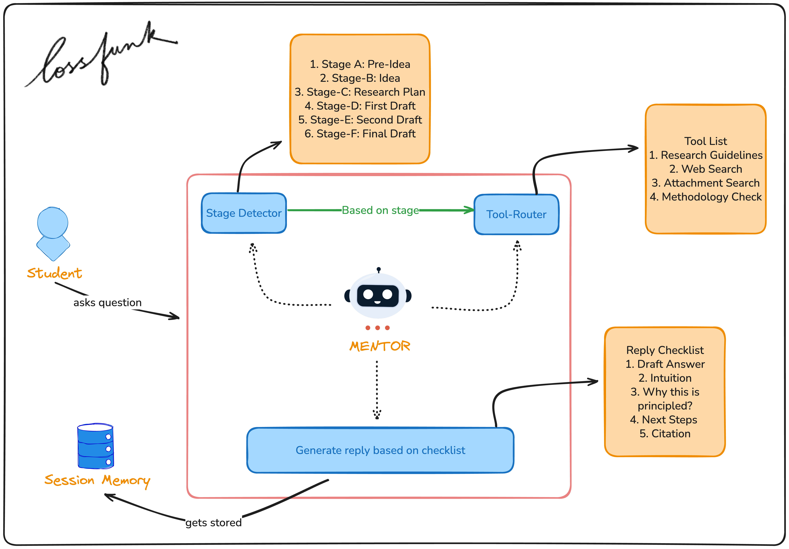
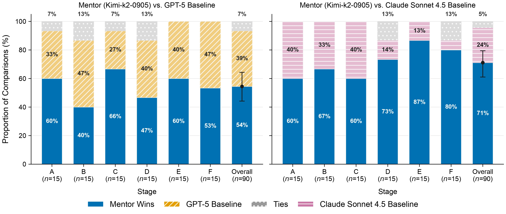

# METIS: Mentoring Engine for Thoughtful Inquiry & Solutions

Code and evaluation artifacts for the preprint **“METIS: Mentoring Engine for Thoughtful Inquiry & Solutions”**.


## Abstract
Many students lack access to expert research mentorship. We ask whether an AI mentor can move undergraduates from an idea to a paper. We build *METIS*, a tool-augmented, stage-aware assistant with literature search, curated guidelines, methodology checks, and memory. We evaluate *METIS* against GPT-5 and Claude Sonnet 4.5 across six writing stages using LLM-as-a-judge pairwise preferences, student-persona rubrics, short multi-turn tutoring, and evidence/compliance checks. On 90 single-turn prompts, LLM judges preferred *METIS* to Claude Sonnet 4.5 in 71% and to GPT-5 in 54%. Student scores (clarity/actionability/constraint-fit; 90 prompts × 3 judges) are higher across stages. In multi-turn sessions (five scenarios/agent), *METIS* yields slightly higher final quality than GPT-5. Gains concentrate in document-grounded stages (D–F), consistent with stage-aware routing and grounding; failure modes include premature tool routing, shallow grounding, and occasional stage misclassification.

## System overview



## Key results


## Evaluation results & scripts

The preprint artifacts and runnable scripts are consolidated under the [evaluation-results/](evaluation-results/) folder.

### Single-turn evals
- **Scripts**: `evaluation-results/scripts/evals-for-papers-scripts/`
  - Example: `bash evaluation-results/scripts/evals-for-papers-scripts/run_stage_a.sh`
  - Pairwise: `bash evaluation-results/scripts/evals-for-papers-scripts/run_stage_a_pairwise.sh`
  - Judges/metrics: `bash evaluation-results/scripts/evals-for-papers-scripts/run_stage_a_judges.sh`
- **Key outputs** (snapshot used for the preprint):
  - `evaluation-results/single_turn/evals-for-papers-results/` (raw logs + per-stage `analysis_reports/`)
  - `evaluation-results/single_turn/reports-evals/` (summary JSON + rendered figures)

### Student LLM-as-a-judge evals
- **Runner**: `uv run python evaluation-results/scripts/evaluation-scripts/run_student_judge_scores.py`

### Multi-turn evals
- **Runner**: `uv run python evaluation-results/scripts/evaluation-scripts/run_multi_turn_evals.py`
- **Key outputs** (snapshot used for the preprint): `evaluation-results/multi_turn/multi_turn_eval_all5/`

### Run all single-turn stages (A–F)
To run the full evaluation suite and generate a combined summary:
```bash
uv run python evaluation-results/scripts/evaluation-scripts/run_all_stages.py
```

## Installation

### Backend Server
```bash
uv sync
```

### Frontend UI
```bash
cd web & npm install
```

## Environment
```bash
cp .example.env .env
```

Required (at least one):
- `OPENROUTER_API_KEY` (recommended)
- `OPENAI_API_KEY`

Optional (enables additional retrieval providers):
- `TAVILY_API_KEY`

## Run METIS (mentor)

### Backend server
```bash
uv run python -m uvicorn academic_research_mentor.server:app --reload --port 8000
```

### Frontend UI
```bash
cd web && npm run dev
```

# Acknowledgement
We thank Lossfunk for its support throughout this project. This work benefited from access to compute resources provided by Lossfunk, as well as constructive discussions and idea-level guidance that helped shape the direction of this research.
